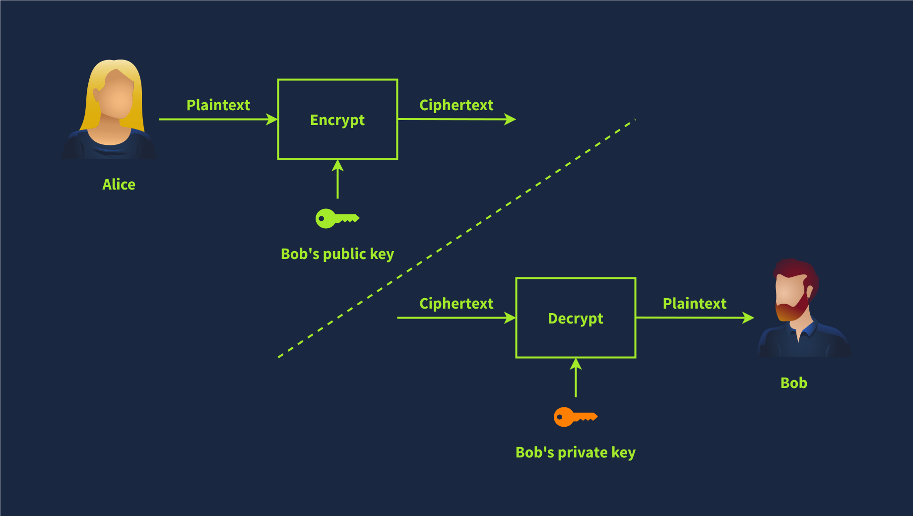

# Task 2: Use of Asymmetric Encryption

This task explains the **primary use of asymmetric encryption** through a simple real-world analogy and connects it to how secure communication works in practice.

## Mapping the Analogy to Cryptography

| Analogy Element | Cryptographic System |
|----------------|----------------------|
| Secret code | Symmetric encryption cipher and key |
| Lock | Public key |
| Lock’s key | Private key |

In cryptographic terms:
- The **public key** is shared openly and used to protect (encrypt) data
- The **private key** is kept secret and used to unlock (decrypt) data
- The **symmetric key** is the fast, efficient method used for ongoing secure communication

---

## Why Asymmetric Encryption Is Used This Way

Asymmetric encryption is **computationally expensive** and slower than symmetric encryption.  
Because of this:

- It is typically used **only once** to securely exchange a symmetric key
- After the key exchange, communication switches to **symmetric encryption**

This approach provides:
- Secure key distribution
- High performance for ongoing communication

---

## Real-World Examples

This hybrid approach is widely used in practice, including:
- **TLS/HTTPS** – Public key cryptography to exchange keys, symmetric encryption for data transfer
- **SSH** – Public key authentication followed by encrypted sessions
- **Secure messaging applications**

---

## Key Takeaway

Asymmetric cryptography solves the **key distribution problem**, allowing two parties to securely agree on a shared secret. Once that secret is established, **symmetric encryption** is used to ensure fast and confidential communication.

This balance between security and performance is fundamental to modern secure systems.
